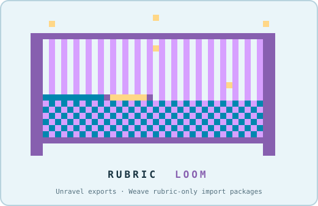

# Rubric Loom

<p align="center">
  
</p>

Rubric Loom is a guided local tool for people who need to inspect, revise,
draft, or move Brightspace rubrics without hand-editing D2L XML. It can
deconstruct a Brightspace course export and package revised or newly drafted
rubrics for later import. It opens with two clear choices:

| Door | Bring | Take away |
| --- | --- | --- |
| **Unravel** | A Brightspace course-export ZIP, an unpacked export folder, or a bare `rubrics_d2l.xml` | A review workbook, structured rubric JSON, and a reviewer DOCX |
| **Weave** | A completed rubric in a supported DOCX table, Markdown table, or JSON format | A reviewed and validated rubric-only Brightspace import package, plus its mapping, diagnostics, and run receipt |

Unravel can read one export or inventory a folder of exports in a single bulk
run. Each course retains its own output folder and run log. Weave shows how
its rules read the completed rubric source—including its content, scoring,
and weights. Before building the package, Weave asks you to verify what it
read and approve the build.

Rubric Loom is purely deterministic software, running locally in Python. It is
engineered against known Brightspace/D2L package structures. No AI model reads
or interprets your files, and your files stay on your computer. The same input
meets the same declared rules every time; an unfamiliar structure is reported
instead of guessed or inferred.

> [!IMPORTANT]
> **Download the release, not the source-code ZIP.** Use **Releases** in the
> repository sidebar and download `rubric-loom-managed-v<VERSION>.zip`. Do not
> use the green **Code > Download ZIP** button; that archive omits the paired
> Rubric Bundle engine.
>
> **macOS first launch:** unzip the release and try `Rubric Loom.command` once.
> If macOS blocks it, open **System Settings > Privacy & Security**. Under
> **Security**, click **Open**, then **Open Anyway**, enter your Mac login
> password, and confirm the launch.
>
> See [Install, update, and troubleshoot Rubric Loom](INSTALL_AND_TROUBLESHOOT.md)
> for the complete first-run workflow, Python and dependency behavior, update
> and rollback commands, log locations, and product-specific troubleshooting.

If you encounter an error, please
[open a GitHub issue](https://github.com/timebeing92/brightspace-rubric-loom-runner/issues)
and include your operating system, whether you were using Unravel or Weave,
the steps that led to the error, and the complete error message. Do not post
course exports, institutional rubrics, learner data, or other sensitive
course material.

## Download and start

The recommended download is:

`rubric-loom-managed-v<VERSION>.zip`

Unzip it before opening the Loom. Then:

- **macOS:** double-click `Rubric Loom.command`. If macOS blocks the first
  launch, use the authorization steps in the callout above or the linked
  install guide.
- **Windows:** double-click `Rubric Loom.bat`.
- **Linux:** run `bash rubric_loom_launcher.sh`.

On first run, the launcher looks for an existing supported Python
3.11–3.13 installation and reuses it. Python itself is not reinstalled when a
supported copy is already present. The Loom then checks its required support
packages before asking you to choose Unravel or Weave or provide a path. If
needed, it offers to create a private environment under `user-data/runtime`
and install the pinned packages there—not into the system Python. Only when no
supported Python is found does the launcher offer to install Python, and it
asks first.

The managed package keeps program versions and user work separate:

```text
rubric-loom-managed-v<VERSION>/
├── Rubric Loom.command
├── Rubric Loom.bat
├── START_HERE.txt
├── current.json
├── versions/
│   └── <VERSION>/
│       ├── brightspace-rubric-loom-runner/
│       ├── brightspace-rubric-bundle/
│       └── RELEASE_MANIFEST.json
└── user-data/
```

Inputs, outputs, remembered settings, logs, and the private Python environment
stay under `user-data/`. A later update installs a complete release beside the
current one; rollback changes the active pointer without deleting user work.

The smaller portable ZIP, `rubric-loom-v<VERSION>.zip`, contains the same
tested runner/bundle pair without side-by-side update management. It is useful
for a temporary or controlled installation.

## What the Loom does—and does not do

A Brightspace course export is an ordinary ZIP file. Its `imsmanifest.xml`
maps package resources, and D2L XML files carry component details such as
rubrics. Unravel follows those declared structures and preserves authored
rubric wording and values in review-ready formats. Bulk Unravel repeats that
same producer run for each immediate export in the folder; it does not add a
second extraction implementation.

Weave accepts the documented rubric source shapes, normalizes them to the
versioned authoring contract, validates scoring and weights, constructs
`rubrics_d2l.xml`, and validates the final rubric-only package. Missing scoring
or weights stop the build unless you explicitly select a permitted fallback.

Rubric Loom does not:

- import anything into Brightspace;
- attach an imported rubric to an assignment, discussion, or quiz;
- invent scoring silently;
- change a course when you download or complete a template; or
- replace human review.

After Weave succeeds, you review the output, import the package yourself, and
attach the rubric manually in Brightspace.

## Updates and verification

The Loom checks the public GitHub release feed at most once per day. Current,
offline, and failed checks stay quiet. When a newer release exists, the Loom
shows the installed and available versions; it does not replace files without
your action.

The managed launcher verifies all of the following before activating an
update:

- the GitHub asset digest and published `.sha256` sidecar agree;
- the ZIP has one safe top-level folder and contains no path traversal,
  symbolic links, encrypted members, reserved Windows names, or
  case-colliding paths;
- the runner and bundle repository identities and exact commits match the
  release manifest;
- critical runtime files match their SHA-256 receipts; and
- the Unravel, Weave, progress, rubric, authoring, and run-receipt contracts
  are present and match their receipts.

Useful managed-install commands:

```bash
bash rubric_loom_launcher.sh --health
bash rubric_loom_launcher.sh --list-versions
bash rubric_loom_launcher.sh --update
bash rubric_loom_launcher.sh --rollback
```

## Architecture and source boundary

This repository owns the one-download experience: launchers, environment
setup, release pairing, update verification, activation, rollback, and
persistent user-data boundaries. It does not parse Brightspace XML or define
rubric semantics.

CourseCraft Workbench is the upstream living library and development lab for
the CourseCraft tool family. It curates the authoritative development copies
of shared schemas and producer code alongside scripts, tests, experiments,
technical writing, and documentation. Work there may be exploratory; only
reviewed, verified, production-ready versions are promoted into pinned
products such as the Rubric Bundle and this runner. People using Rubric Loom
do not need to access, install, or operate the Workbench.

[`brightspace-rubric-bundle`](https://github.com/timebeing92/brightspace-rubric-bundle)
is the pinned engine. It owns the Unravel and Weave orchestrators and contains
exact promoted copies of the Workbench-owned rubric schemas and producer
implementation. The bundle records their deeper provenance in its own
`upstream/workbench_pin.json`; the runner records the exact bundle release,
commit, schema digests, capability declarations, and runtime digests in
`RELEASE_MANIFEST.json`.

This separation is deliberate:

```text
CourseCraft Workbench
(living library + development lab)
        │ reviewed, production-ready tooling
        ▼
brightspace-rubric-bundle
        │
        ├── CourseCraft Workshop
        └── brightspace-rubric-loom-runner
```

Changes to rubric interpretation, scoring, XML construction, or validation
must move through the Workbench’s review and verification process and the
Rubric Bundle source boundary. Runner code may supervise the engine and
present its reported results; it may not recreate those semantics.

See [ADOPTION_MAP.md](ADOPTION_MAP.md) for the ownership map and
[NOTICE.md](NOTICE.md) for attribution and provenance.

## License

Rubric Loom Runner is licensed under
`AGPL-3.0-or-later`; see [LICENSE](LICENSE). Commercial licenses and paid
services are available by agreement for organizations that need different
terms, private deployment rights, integration support, maintenance, or
procurement assurances; see [COMMERCIAL.md](COMMERCIAL.md).
